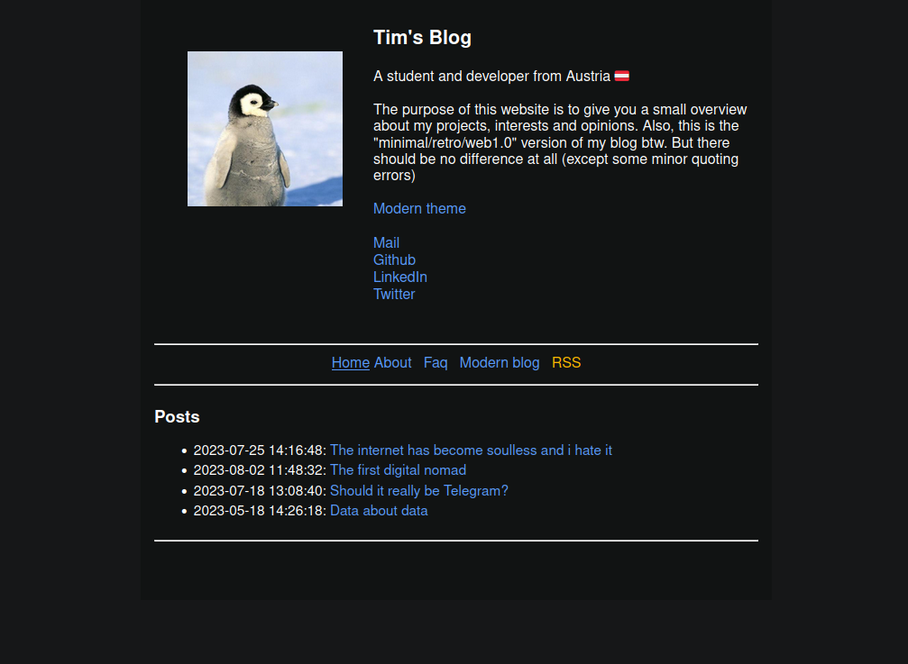

# Classic blog




An alternative frontend to view my blog. I originally created this repo in order to make my website accessible for non-javascript browsers but php kinda grew on me (crazy, right?)

### Installation

I also included a docker file in case you wanted to host it by yourself:

```
git clone https://github.com/timkicker/classic-blog
git submodule update --init --recursive
docker compose up --build
``````
The webui should be available under the specific `.env` port (default 8087)

**Important note:** Since my real blog is implemented as a git sub-module, you'll have to update it manually via `git submodule update --recursive --remote` or create a cron job. You may want to use [my script](https://github.com/timkicker/scripts) for that.
